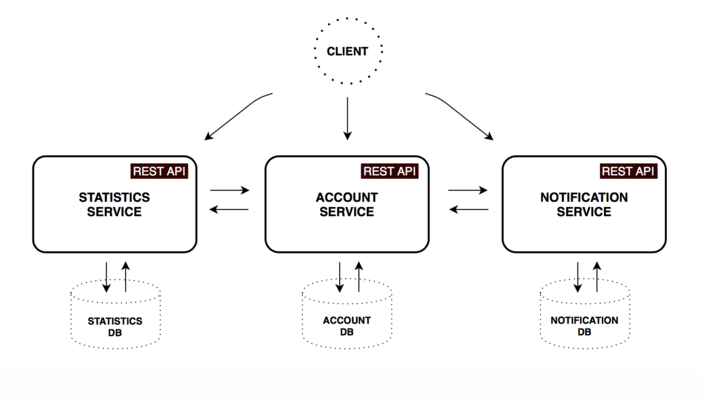
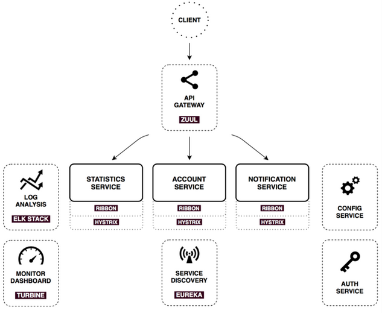

# IMPORTANTE 


**Lo siguiente es solo una traduccion al trabajo del señor Alexander Lukyanchikov**
**[https://github.com/sqshq](https://github.com/sqshq)**


En particular su trabajo [PiggyMetrics](https://github.com/sqshq/PiggyMetrics) Publicado en [http://my-piggymetrics.rhcloud.com/](http://my-piggymetrics.rhcloud.com/)

La intencion de este repositorio es unicamente para efectos didaticos y con la finalidad de acelerar mediante la traduccion del proyecto el aprendaze de aquellos desarrolladores que con animos de incursionar en el nuevo paradigma de los microservicios buscan material practico y que el presente sirva como base conceptual practica.

**Nada de lo traducido a contiuacion pretende de ninguna forma ser un plagio...**

Aclarado el punto... a lo que venimos....


## Piggy Metrics (Metricas Puerquito)

> **Una manera sencilla de llevar los gastos personales**

Estos es una prueba de concepto [proof-of-concept application](http://my-piggymetrics.rhcloud.com), que demuestra como  implementar [El patron de arquitectura de Microservicios](http://martinfowler.com/microservices/) usando Spring Boot, Spring Cloud Y Docker con una pequeña y bonita interface, por cierto.


## Servicios Funcionales

PiggyMetrics fue descompuesto en 3 microservicios core. Todos ellos son independientemente desplegables y organizados al rededor de un dominio de negocio.



#### Account service

Contiene la lógica general de validaciones de entrada de usuarios, ingresos y gastos, ahorros, y configuraciones de cuentas

Method	| Path	| Description	| User authenticated	| Available from UI
------------- | ------------------------- | ------------- |:-------------:|:----------------:|
GET	| /accounts/{account}	| Get specified account data	|  | 	
GET	| /accounts/current	| Get current account data	| × | ×
GET	| /accounts/demo	| Get demo account data (pre-filled incomes/expenses items, etc)	|   | 	×
PUT	| /accounts/current	| Save current account data	| × | ×
POST	| /accounts/	| Register new account	|   | ×


#### Statistics service

Realiza cálculos principales sobre parámetros estadísticos, captura las series de tiempo para cada cuenta. Datapoint contiene valores normalizados a la moneda actual y el período de tiempo. Estos datos se utilizan para realizar un seguimiento del flujo de efectivo en el ciclo de vida de la cuenta.


Method	| Path	| Description	| User authenticated	| Available from UI
------------- | ------------------------- | ------------- |:-------------:|:----------------:|
GET	| /statistics/{account}	| Get specified account statistics	          |  | 	
GET	| /statistics/current	| Get current account statistics	| × | × 
GET	| /statistics/demo	| Get demo account statistics	|   | × 
PUT	| /statistics/{account}	| Create or update time series datapoint for specified account	|   | 


#### Notification service

Almacena la información de la cuenta de los usuarios y configura las notificaciones (como recordar y respaldar la frecuencia). El worker programado recopila la información requerida de otros servicios y envía mensajes de correo electrónico a los clientes suscritos.

Method	| Path	| Description	| User authenticated	| Available from UI
------------- | ------------------------- | ------------- |:-------------:|:----------------:|
GET	| /notifications/settings/current	| Get current account notification settings	| × | ×	
PUT	| /notifications/settings/current	| Save current account notification settings	| × | ×

#### Notas

- Cada microservicio tiene su propia base de datos por lo que no hay forma de que se accesda en manera bypass a la persistencia directamente.
- Se uso MongoDB como base primaria para cada servicio esto lleva un sentido de hacer la persistencia poliglota en la arquitectura (elegir el tipo de base de datos acorde al requerimiento es la mejor opcion siempre).
- La comunicacion Service-to-service esta un poco simplificada: los microservices se hablan usando unicamente synchronous REST API. La practica cumun en el mundo real es el uso combinado de sincronos  y asincronos
	- Por ejemplo, Realizar sincronos los request GET para el retrieve de datos y usar enfoque asincronno por medio de Message broker para hacer operaciones de creates/update y asi poder desacoplar los services del buffer de mesajes. sin embargo esto lleva eventualmente a que tengamos la [eventual consistency](http://martinfowler.com/articles/microservice-trade-offs.html#consistency).

## Infraestructura de los services

Hay un monton de patrones comunes en los sistemas distribuidos que prodrian ayudarnos a hacer que los servicios core descritos funcionen. [Spring cloud](http://projects.spring.io/spring-cloud/) nos da herramientas poderosas que se basen en aplicaciones spring boot para imprementar esos patrones, se cubriran a continuacion.




### Config service

[Spring Cloud Config](http://cloud.spring.io/spring-cloud-config/spring-cloud-config.html) es escalable horizontalmente y el servico de configuraciones para sistemas distribuidos. Se usa como capa de repositorio pluggable que actualmente soporta almacenamiento local, git y subversion.

Para este proyecto se usa `native profile`, que simplifica la carga de los archivos del classpath local. Puede verse el directorio `shared` directory en [Config service resources](https://github.com/sqshq/PiggyMetrics/tree/master/config/src/main/resources).

Ahora cuando el servicio de Notification solicite su configuration, El Config service responde con  `shared/notification-service.yml` y  `shared/application.yml` (que son compartidos entre todos los clientes de la aplicacion).

##### Usos del lado del Client

Nada mas agregando la dependencia `spring-cloud-starter-config` al cliente la autoconfiguration hara el resto

Ya no necesitas ninguna propiedad embebida en tu aplicacion. nada mas tenemos que configurar `bootstrap.yml` con el nombre de la aplicacion y la url del Config service:


```yml
spring:
  application:
    name: notification-service
  cloud:
    config:
      uri: http://config:8888
      fail-fast: true
```

##### Con Spring Cloud Config puedes cambiar configuraciones dinamicamente

Por ejemplo el [EmailService bean](https://github.com/sqshq/PiggyMetrics/blob/master/notification-service/src/main/java/com/piggymetrics/notification/service/EmailServiceImpl.java) fue anotado con `@RefreshScope`.  que lo quiere decir que se puede cambiar del e-mail de notificacion el contenido y el asunto sin tener que reconfigurar y reiniciar el servicio de Notificacion de la aplication.

Lo primero es ambiar el properties requerido en el Config server. luego hacer un refresh al servicio de noticacion:

`curl -H "Authorization: Bearer #token#" -XPOST http://127.0.0.1:8000/notifications/refresh`

Tambien se puede usar el Repository [webhooks to automate this process](http://cloud.spring.io/spring-cloud-config/spring-cloud-config.html#_push_notifications_and_spring_cloud_bus)

##### Notas

- Hay algunas limitantes para el refresco dinamico. `@RefreshScope` no trabaja con clases `@Configuration` y no afecta los metodos `@Scheduled`
- la propiedad `fail-fast` significac que  la aplicacion Spring Boot application va a fallar inmediatamete si no esta conectado a un servicio Config Service.
- Hay significativas [security notes](https://github.com/sqshq/PiggyMetrics#security) a seguir.

### Servicio de Auth


La responsabilidad de Authorization esta completamente delegada a un servidor separado que otorga  [OAuth2 tokens](https://tools.ietf.org/html/rfc6749) para servir los recursos del backend. Auth Server es usado por usuarios autorizados como tambien por comunicaciones  machine-to-machine dentro del la perimetria.

En este proyecto se uso  [`Password credentials`](https://tools.ietf.org/html/rfc6749#section-4.3) que da autorizacion de tipo usuario (ya que solo es usado por el front end de PiggyMetrics) y [`Client Credentials`](https://tools.ietf.org/html/rfc6749#section-4.4) da permisos a autorizacion  microservices.

Spring Cloud Security provee de anotaciones y  autoconfiguraciones para hacerlo realmente facil de implementar tanto del lado del server como del cliente, puedes aprender mas de su [documentation](http://cloud.spring.io/spring-cloud-security/spring-cloud-security.html) y checha los detalles de configuracion en [Auth Server code](https://github.com/sqshq/PiggyMetrics/tree/master/auth-service/src/main/java/com/piggymetrics/auth).

Del lado del cliente todo funciona exactamente igual que la tradicional forma basada en sesion autorizada. puedes hacer retrieve del objeto `Principal` del request, checa el rol del user y otras cosas con control de acceso basado en una expresion y la anotacion `@PreAuthorize`.

Cada cliente en PiggyMetrics (account-service, statistics-service, notification-service and browser) tiene un scope: `server` para servicios backend y `ui` - para el browser. Por lo que podemos tambien proteger controles de una acceso externo, por ejemplo:

``` java
@PreAuthorize("#oauth2.hasScope('server')")
@RequestMapping(value = "accounts/{name}", method = RequestMethod.GET)
public List<DataPoint> getStatisticsByAccountName(@PathVariable String name) {
	return statisticsService.findByAccountName(name);
}
```

### API Gateway

Como se puede apreciar hay 3 servicios core con un api expuesto al cliente, en un sistema del mundo este numero podria crecer muy rapidamente tanto como la complejidad del sistema mismo. Realmente miles de servicios pueden estar involucrados en el  rendering de una webpage compleja.

En teoria un cliente podria hacer requests a cada microservicio directamente, pero obviamente, hay muchos retos y limitaciones a esta opcion, como por jemplo saber todos las direcciones de los endpoints, realizar requests http para cada lugar de informacion de manera separada, juntar el resultado para el cliente, Otro problea es los protocolos nada amigables web que debe usar el backend.

Usualmente el mejor enfoque es usar un API Gateway, Este es el unico endpoint para el sistema, usado par manejar request enrutandolos a los apropiados servicios o ligando los multiples servicios del backend y usando el patron [aggregating the results](http://techblog.netflix.com/2013/01/optimizing-netflix-api.html).

Tambien pueden usar autenticacion, hayazgo y canary testing, service migration, static response handling, active traffic management.

Netflix "opensourcea" [such an edge service](http://techblog.netflix.com/2013/06/announcing-zuul-edge-service-in-cloud.html), y ahora con Spring Cloud podemos habilitarlo con la anotacion `@EnableZuulProxy`.

En este proyecto Se usa Zuul para almacenar contenido estatico (ui application) y para dirigir requests a los apropiados microservices. Aqui hay un ejemplo de como se configuro para los servicios de Notification el enrutamiento:

```yml
zuul:
  routes:
    notification-service:
        path: /notifications/**
        serviceId: notification-service
        stripPrefix: false

```

Eso significa que todos los  requests que comienzan con `/notifications` seran enrutados al servicio Notification no hay direcciones hardcodeadas, como puedes ver Zuul usa mecanismo de [Service discovery](https://github.com/sqshq/PiggyMetrics/blob/master/README.md#service-discovery) para localizar el servicio Notification service tambien instancia [Circuit Breaker and Load Balancer](https://github.com/sqshq/PiggyMetrics/blob/master/README.md#http-client-load-balancer-and-circuit-breaker), descrito a continuacion.

### Service discovery

Otro muy comun  conocido patron en la arquitectura es el Service discovery. este te deja detectar en la red automaticamente locaciones de servicios las cuales podrian tener direcciones asignadas dinamicamente debido a cuestiones de auto escalamiento, caidas y relanzamientos en algun servicio.

La parte clave del Service discovery es el Registry. Se usa Netflix Eureka en este projecto. Eureka es una buena implementeacion del patron para el client-side, cuando el cliente es responsable de determinar las ubicaciones de las instancias de servicio disponibles (utilizando el servidor del Registro) y las solicitudes de equilibrio de carga a través de ellas.

Con Spring Boot puedes facilmente construir  Eureka Registry con la dependencia `spring-cloud-starter-eureka-server`, la anotacion `@EnableEurekaServer` y una simple configuracion del properties.

Client suporta la habilitacion con la anotacion `@EnableDiscoveryClient` en el `bootstrap.yml` con el nombre de la aplicacion:

``` yml
spring:
  application:
    name: notification-service
```

Ahora que la aplicacion se levanto se registrara con Eureka Server y prove de  meta-datos, tales como el host el puerto, indicador de salud URL, home page etc. Eureka recibe mensajes de heartbeat de cada una de las salidas de orugen de un service. si el heartbeat falla segun sea el timetable configurable, la instancia será removida del registry.

Además, Eureka proporciona una interfaz sencilla donde puede realizar un seguimiento de los servicios en ejecución y el número de instancias disponibles: `http://localhost:8761`

### Balanceo de carga, Corto Circuito y Cliente Http

Netflix OSS provee de otro gran set de herramientas.


#### Ribbon


Ribbon es un balanceador de carga del lado del cliente que da mucho control sobre el comportamiento de clientes HTTP  y TCP. Comparados con los tracionales balanceadores de carga, aqui no necesitas adicionar nada para cualquier invocacion  over-the-wire - puedes contactar el servicio deseado dirsectamente.

Saliendo de la caja, es nativamente integrado con Spring Cloud y Service Discovery. [Eureka Client](https://github.com/sqshq/PiggyMetrics#service-discovery) provee una lista dinamica de servidores disponibles y con Ribbon podrias blancerlaros entre ellos.

#### Hystrix

Hystrix es la implementacion de un  [Circuit Breaker pattern](http://martinfowler.com/bliki/CircuitBreaker.html), te da el ontrol sobre la latencia que y fallas del accesos a las dependncias sobre la red.

La idea princpar es parar las fallas en cascada en un entorno distribuido con un gran numero de microservices. Eso te ayuda a fallar rapido y que te recuperes loas mas rapido posible un importante aspecto de la tolerancia fallas del sistema que se  auto sana.

Dentro del control de corto circuito, con Hystrix puedes agregar metodos de fallback method que te llaman a obtener un valor default en caso de que el principal comando falle.

Adicional, Hystrix genera metricas en executiones entrantes y  latencia para cada uno de los comandos, con eso lo podemos usar para [monitor system behavior](https://github.com/sqshq/PiggyMetrics#monitor-dashboard).

#### Feign

Feign es un cliente HTTP declarativo que  sin problemas se  integra con Ribbon y Hystrix. En realidad con agregar la dependencia `spring-cloud-starter-feign` y la anotacion `@EnableFeignClients` tienes el conjunto completo de Load balancer, Circuit breaker y Http client con una configuracion sensible ready-to-go por default.

Aqui un ejemplo del serivioc de Cuenta:

``` java
@FeignClient(name = "statistics-service")
public interface StatisticsServiceClient {

	@RequestMapping(method = RequestMethod.PUT, value = "/statistics/{accountName}", consumes = MediaType.APPLICATION_JSON_UTF8_VALUE)
	void updateStatistics(@PathVariable("accountName") String accountName, Account account);

}
```

- Todo lo que necesitas es solo una interface
- Puedes compartir `@RequestMapping` entreSpring MVC controller y metodos Feign
- El ejemplo anterior solo especifica el id del servicio deseado desired service id - `statistics-service`, gracias al autodiscovery atravez de  Eureka (pero obviamente tu puedes acceder a cualquier recurso con la url especifica)

### Monitor dashboard

En la configuracion de este proyecto cada  microservicio con Hytrix aborda pone su estadistica a Turbine via Spring Cloud Bus (with AMQP broker). El proyecto Monitoring es una pequeña aplicacion Spring boot con [Turbine](https://github.com/Netflix/Turbine) y [Hystrix Dashboard](https://github.com/Netflix/Hystrix/tree/master/hystrix-dashboard).

Ve el siguiente [how to get it up and running](https://github.com/sqshq/PiggyMetrics#how-to-run-all-the-things).

Vamos a ver el comportamiento del sistema bajo carga:

El servicio de Account llama al servicio de Statistics service y le reposnde con una variedad de retrazos. El umbral de tiempo de respuesta se establece en 1 segundo.


	|  |  | 
--- |--- |--- |--- |
`0 ms delay` | `500 ms delay` | `800 ms delay` | `1100 ms delay`
Buen comportamiento sistema. El rendimiento es de aproximadamente 22 peticiones X segundo. Pequeño número de hilos activos en el servicio Estadísticas. El tiempo medio de servicio es de unos 50 ms. | El numero de threads esta creciendo. Lo podemos ver en color purpura el numero de rechazos del thread-pool de alrededor 30-40% de errores, pero el circuito aun esta cerrado. | Estado mitad abierto: El porcentaje de los comandos fallidos es de mas de 50%, El circuito aun tiene ladrillos. Despues de uan ventana de tiempo de sleep la siguiente solicitud es dejada pasar | 100%  de todos los requests fallan. El circuito esta permanentemente abierto. Intentar despues del tiempo sleep no hara que se cierre el circuito ya que un simple reques es demasiado lento|


### Log analysis

Centralizar las trazas logs es muy util al momento de identificar problemas en estos ambientes distribuidos. Elasticsearch, Logstash y Kibana en conjunto nos dejan buscar y analizar  logs, utilizacion y actividad de red listos para usar en configuracion docker descrita en [este otro projecto](http://github.com/sqshq/ELK-docker).

## Seguridad

Una configuración de seguridad avanzada está más allá del alcance de este proyecto de prueba de concepto. Para una simulación más realista de un sistema real, considere utilizar https, almacén de claves JCE para cifrar las contraseñas de Microservices y el contenido de las propiedades del servidor de configuración (consulte [documentación](http://cloud.spring.io/spring-cloud-config/spring- cloud-config.html #_security) para más detalles).


## Automatizacion de Infrastructura

Deployar microservicios cons sus interdependencias es muchas mas compeljo que el deploy de una aplicacion monolitica. Es importante tener toda la infraestructura completamente automatizada. Podemos lograrla scon los benedicios del enfoque de la Continuous Delivery:

- La habilidad de hacer release en cualquier momento
- Cualquier build se puede convertir en un release
- Build de artifactos una vez - deploy Cuando los necesites

Aqui esta un workflow simple de un Continuous Delivery que se ha implementado en este projecto:


En esta  [configuracion](https://github.com/sqshq/PiggyMetrics/blob/master/.travis.yml), Travis CI genera imágenes etiquetadas apartir de un push a git exitoso. Por lo tanto, siempre hay `última` imagen para cada microservice en [Docker Hub](https://hub.docker.com/r/sqshq/) y imágenes más antiguas, etiquetadas con el hash del commit. Es fácil desplegar cualquiera de ellos y retroceder rápidamente, si es necesario.

## ¿Como correr todas estas cosas?

Acuerdate que estas inciciando 8 aplicaciones Spring Boot, 4 instancias MongoDB y RabbitMq.

Asegurate de tener `4 Gb` RAM habilitadas en tu maquina. puedes correr solamente los servicios vitales: Gateway, Registry, Config, Auth Service and Account Service.

#### Andes de que inicies

- Instala Docker y Docker Compose.
- haz un Export de las variables de entorno: `CONFIG_SERVICE_PASSWORD`, `NOTIFICATION_SERVICE_PASSWORD`, `STATISTICS_SERVICE_PASSWORD`, `ACCOUNT_SERVICE_PASSWORD`, `MONGODB_PASSWORD` (asegurate que esten expuestas: `printenv`)
- Asegurate de construir el proyecto: `mvn package [-DskipTests]`

#### Modo Produccion

De esta forma todas las imagenes mas recientes (latest tag)seran "pulleadas" de Docker Hub.

Nada mas copia `docker-compose.yml` y da un `docker-compose up`

#### Modo Desarrollo

Si quisieras construir tu mismo imagenes (Con algunso cambios al codigo por ejemplo), debes clonar todo el repositorio y construir los artefactos con maven y luego correr

`docker-compose -f docker-compose.yml -f docker-compose.dev.yml up`

`docker-compose.dev.yml` hereda de `docker-compose.yml` con la posibilidad adicional de contruir imagenes localmente y exponer todos los purtos de los contenedores para un entorno mas a modo.

#### Importantes endpoints

- http://localhost:80 - Gateway
- http://localhost:8761 - Eureka Dashboard
- http://localhost:9000/hystrix - Hystrix Dashboard (paste Turbine stream link on the form)
- http://localhost:8989 - Turbine stream (source for the Hystrix Dashboard)
- http://localhost:15672 - RabbitMq management (default login/password: guest/guest)

#### Notas

Todas las aplicaciones Spring Boot requieran estar corriendo [Config Server](https://github.com/sqshq/PiggyMetrics#config-service) para hacer el startup. Pero podemos levantarlas todos los contenedores simultaneamente por la opcion `depends_on` de docker-compose.

Tambien el mecanismo Service Discovery necesita de algo de tiempo para que las applications levanten. Cualquier service que no está disponible para ser descubierto por los clientes hasta que la instancia, el servidor Eureka y el cliente tengan todos los mismos metadatos en su caché local, por lo que podría tardar 3 heartbeats. El tiempo predeterminado del latido del corazón es de 30 segundos.

## Bienvenida la Retroalimentacion

PiggyMetrics es open source y apreciaria mucho tu ayuda. Siente libre de contactarme para cualquier duda o comentario.
